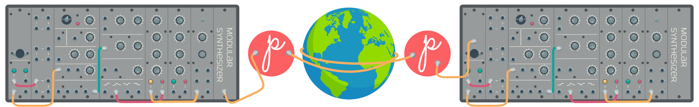
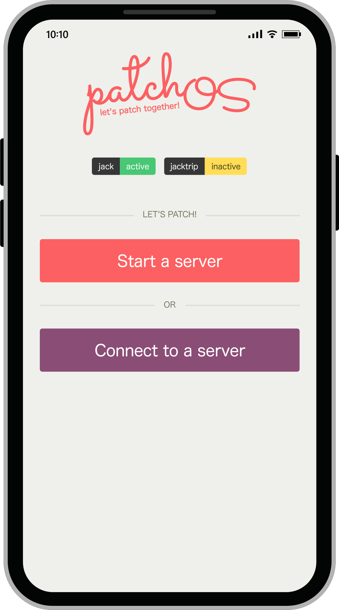

## What is patchOS?

patchOS is an operating system for the Raspberry PI 4 that makes two modular synths patchable over the internet.

## Requirements

- Raspberry PI 4
- 4GB+ SD card
- [Expert Sleepers ES-8 module](https://www.expert-sleepers.co.uk/es8.html)

## How to install

1. Grab the [latest release](https://github.com/elektrofon/patchOS/releases/latest/download/patchOS-rpi4.img.tar.gz) of patchOS
2. Use [etcher](https://www.balena.io/etcher/) to burn patchOS to the SD card
3. Boot your Raspberry PI with the new patchOS SD card

## How to use

Connect an ethernet cable to the Raspberry PI 4 network port.  
Connect your ES-8 to one of the USB ports of the Raspberry PI 4.  
On your phone open your web browser and navigate to `http://patchos.local`.  

You will be met with a simple control panel:

  

Input 1-4 on the ES-8 are sent to the peer,  
and output 1-4 receives signals from the peer.

### Special note for Android users

Android doesen't support mDNS in the browser.
You will therefore not be able to connect to `http://patchos.local`.

Thankfully there's an easy fix by installing a network discovery app.  
A good suggestion is [BonjourBrowser](https://play.google.com/store/apps/details?id=de.wellenvogel.bonjourbrowser)

Install the app and it will find `patchOS control panel` for you.

### If you are behind a NAT or a firewall

patchOS uses `UDP` port `4464` to stream audio.  
If you're behind a NAT router or a firewall you need to forward `UDP` port `4464` to the IP of `http://patchos.local`.  
This is done by logging into your internet modem/router and finding the NAT or firewall settings.

## Notes

patchOS is an experiment; not a product.  
Feedback is most welcome, and pull requests – even more so!
